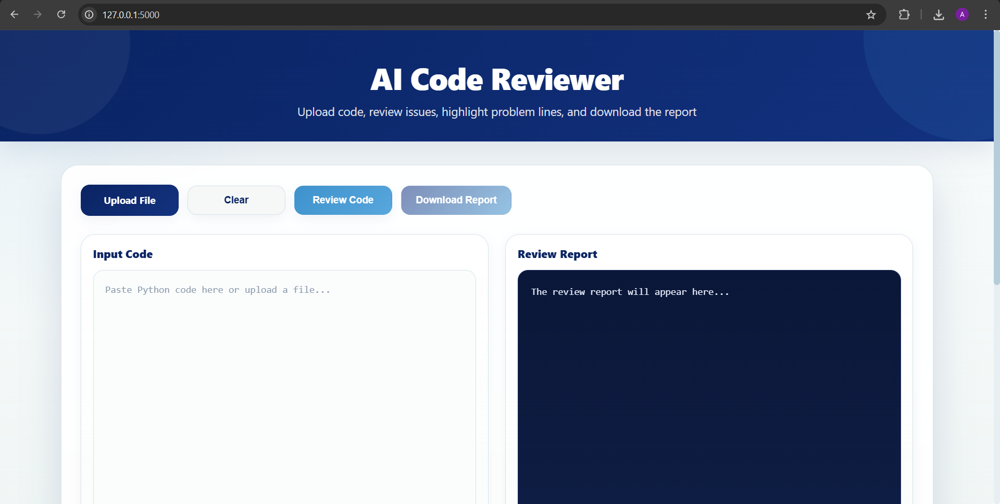
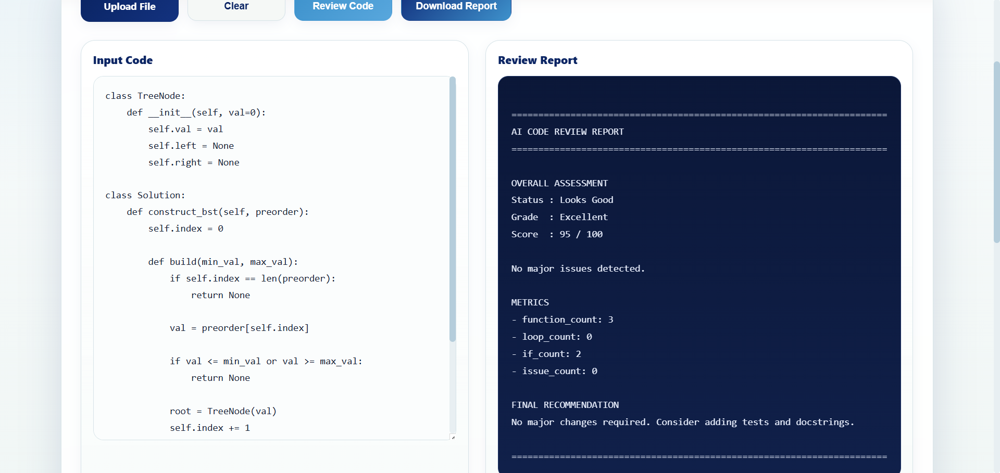

# AI Code Review System

An AI-powered code review tool designed to automatically analyze Python code, detect potential issues, and generate structured feedback for developers.

This project explores how AI-assisted analysis combined with rule-based detection can help developers identify inefficiencies, improve code quality, and streamline the code review process.

---

## Overview

Code reviews are an essential part of modern software development, but manual reviews can be time-consuming and may overlook inefficiencies or potential issues.

The AI Code Review System aims to assist developers by automatically analyzing code and generating structured insights about possible problems.

Users can paste their code or upload a file, and the system will produce a detailed review report highlighting detected issues.

---

## Application Preview

### Home Interface

### Code Review Output

## Features

- Analyze Python code for potential issues
- Detect inefficient patterns such as nested loops
- Highlight problematic lines in the code
- Generate structured code review reports
- Upload code files for analysis
- Download the review report
- Clean and interactive web interface

---

## Current Scope

Currently, the system supports **Python code analysis only**.

Python was chosen as the starting point because of its popularity in backend development and AI/ML workflows.

---

## Future Improvements

Planned improvements include:

- Support for additional programming languages (JavaScript, Java, C++)
- More advanced static code analysis rules
- Improved AI-generated explanations
- Enhanced performance analysis
- Scalable architecture for analyzing larger codebases

---

## Tech Stack

### Backend
- Python
- Flask

### Frontend
- HTML
- CSS
- JavaScript

### AI / Analysis
- Rule-based code pattern detection
- AI-assisted explanation generation

---

## Project Structure
AI-Code-Review-System\
│\
├── app.py\
├── web_review.py\
├── requirements.txt\
│\
├── reviewer/\
│ ├── config\
│ ├── core\
│ ├── ml\
│ └── rules\
│\
├── templates/\
│ └── index.html\
│\
├── static/\
│ ├── style.css\
│ └── script.js\
│\
└── README.md\

---

## Installation

Clone the repository:
git clone https://github.com/Akashsanthosh00/AI-Code-Review-System.git

Navigate into the project directory:
cd AI-Code-Review-System

Install dependencies:
pip install -r requirements.txt

---

## Running the Application

Start the Flask server:
python app.py

open your browser and go to:
http://127.0.0.1:5000

---

## Running with Docker

Build the image:
docker build -t ai-code-review-system .

Run the container:
docker run -p 5000:5000 ai-code-review-system

Then open http://localhost:5000 in your browser.

## Example Workflow

1. Paste Python code or upload a file
2. Click **Review Code**
3. The system analyzes the code
4. Detected issues are displayed in a structured report
5. Problematic lines are highlighted
6. The report can be downloaded

---

## Learning Outcomes

This project helped explore:

- Automated code quality analysis
- Integrating AI concepts into developer tools
- Building full-stack applications using Flask
- Combining rule-based analysis with AI-assisted explanations

---

## Author

Akash SanthoshKumar

GitHub:  
https://github.com/Akashsanthosh00